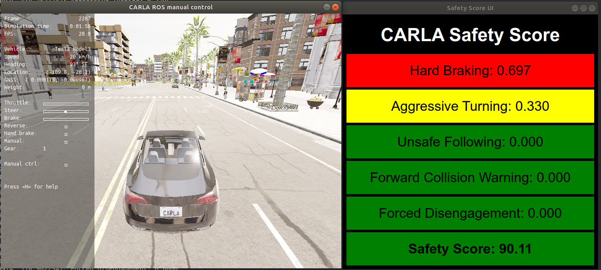
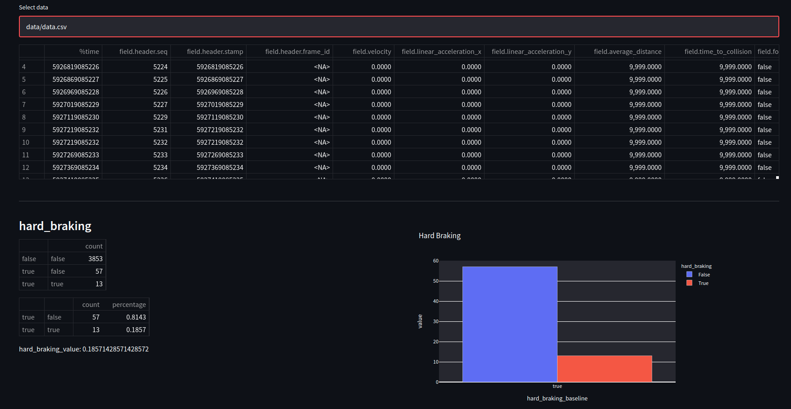
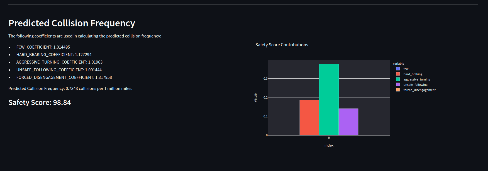

# Safety Score

Tesla-style safety score for CARLA using ROS. 

### [Demo Video](https://youtu.be/rR374mPwH2g)




This node calculates the safety score components using the vehicle's IMU, and Radar. For the full safety score calculation please see: https://www.tesla.com/support/safety-score

## Getting Started
You will need CARLA and carla_ros_bridge installed.

1. Clone this repo into your catkin_ws/src, and build:
```
$ catkin_make
```

2. Launch CARLA: 
```
$ ./opt/carla-simulator/CarlaUE4.sh
``` 
3. Run safety_score nodes (also spawns a vehicle)
```
$ roslaunch safety_score safety_score.launch
```

## UI
The node provides a live user interface for viewing the safety score and calculation components. By default this is launched with the node. 

## Statistics

You can extract the safety score  data topic from a ROSBAG to csv as follows:

```
$ rostopic echo -b bagfile.bag -p /carla/hero/safety_score > data.csv	
```

The data can then be analysed and visualised using streamlit:

```
$ streamlit run app.py
```




## Notes:
- This is just a fun project
- The FCW calculation is incorrect because there is no distance covered metric. 